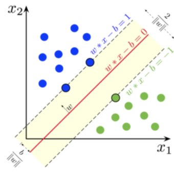

# Compiler-provenance
Machine Learning classifiers, data prediction and multiclass classification

MACHINE LEARNING (Homework 1)
KEY WORDS: Naive Bayes, SVM, KNN

 

This homework has the goal to understand how classifiers works in machine learning problems and to develop some classifiers to making predictions.

Two approaches are required:

- A binary classifier whose detect if a function is optimized with High or Low;

- A multiclass classifier whose predict the current compiler (gcc,icc,clang).

This report will show a ​personal approach to a Naïve Bayes classifier for opt prediction based on a train dataset (file jsonl composed by 30000 instructions); another binary method (​Support Vector Machine classifier​) is implemented to show comparisons and performance. Then it will be shown how to solve the compiler prediction: it was used again the ​SVM classifier (multiclass implementation this time) and a simple variant, the K-Nearest Neighbours classifier​.
After each problem we’ll focus on comparing the algorithms used.

NB: Confusion matrices are computed to visualize the performance of each experiment

## DOC
[Here](Report.pdf) you can find the report.pdf abot this work

Final accuracy comparing algorithms:

## About the files
@autor: Lorenzi Flavio 

Scripts in python:
.binary = binary naive bayes for opt prediction --> reached accuracy: 0.596
.svm = binary (linear) svm for opt prediction --> reached accuracy: 0.623
.multiclass = multiclass svm methods for compiler prediction --> reached (total) accuracy: 0.698
.knn = multiclass knn classifier for compiler prediction --> reached (total) accuracy: 0.61
.utils = file with all implemented extra methods

svm_test = testing blind dataset with binary svm

multiclass_test = testing with svm
